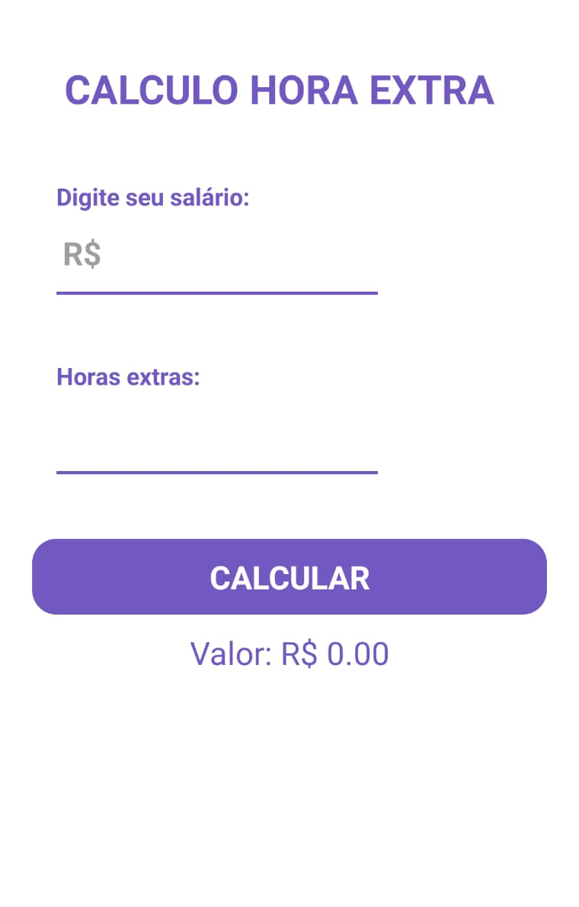

# CalcHorasExtras
App para realizar cálculo de horas extras na empresa

# Tecnologias
React Native

Menu realizado com  [CreateStackNavigator](https://reactnavigation.org/docs/stack-navigator/)


Main



## Development setup


```sh
npm install or yarn
npm run-android or yarn run-android
```
